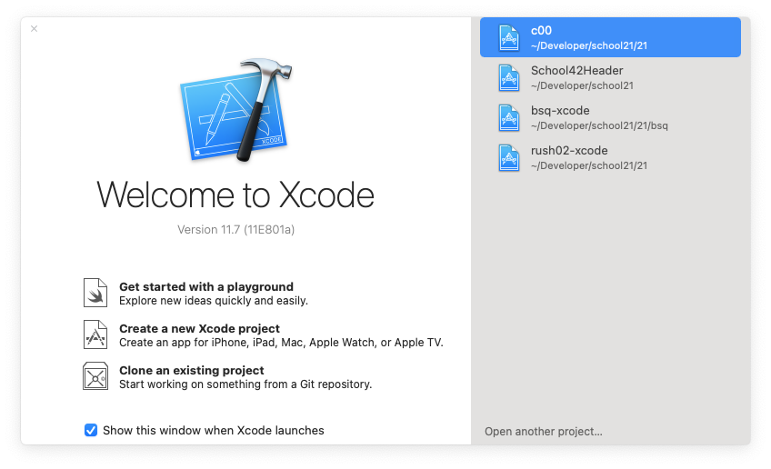
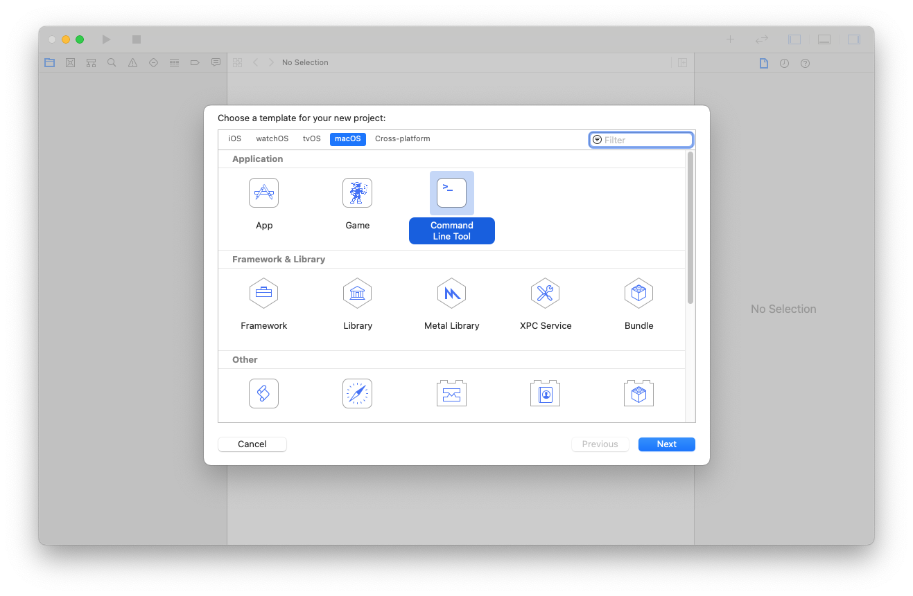
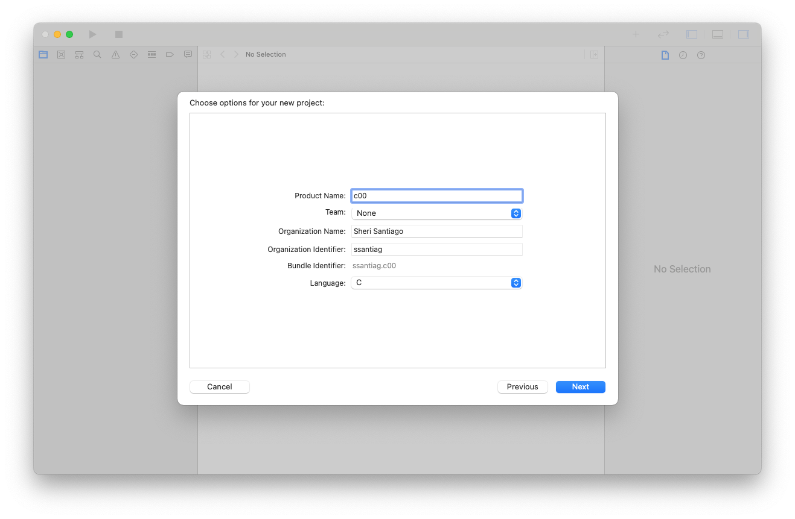
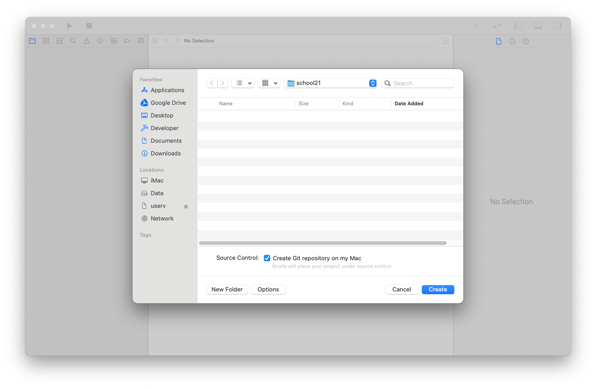
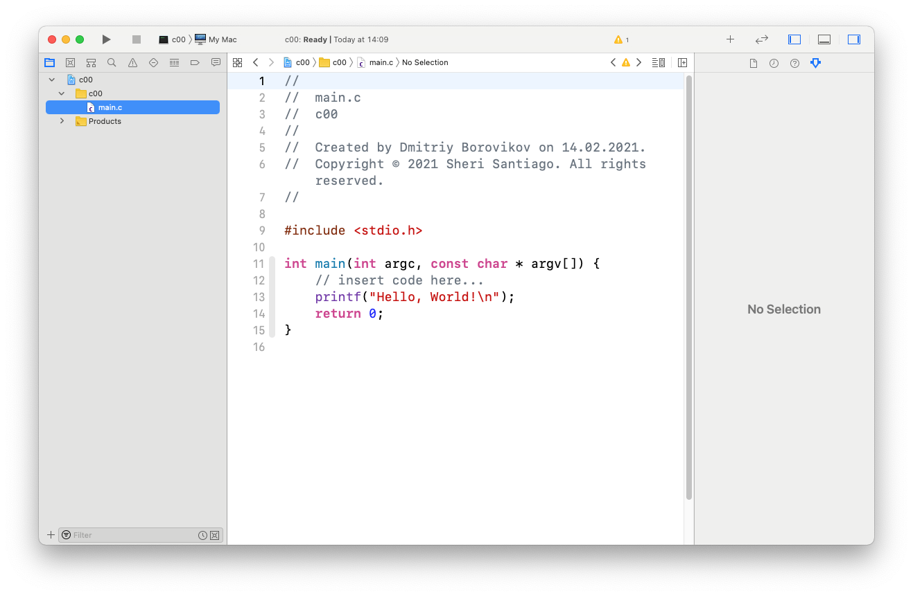
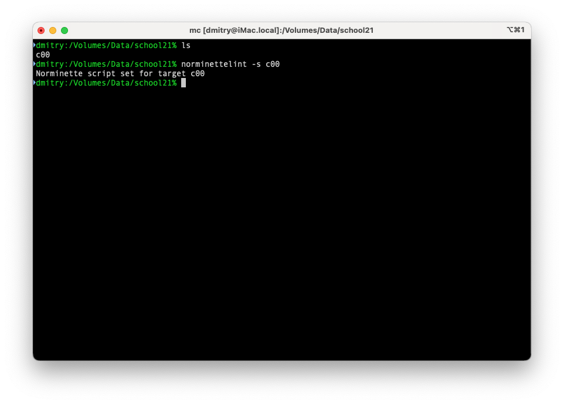

# Создание проекта в Xcode.
1. Запустить Xcode, выбрать `Create a new Xcode project`

* Выбрать `macOS`, `Command Line Tool`

* Ввести название проекта, своё имя в `Organization name`, свой ник в `Organization Identifer`, выбрать Language `C`.

* Выбрать папку, где будет размещаться проект. Можно так же сразу создать репозиторий Git, но это не обязательно, к репозеторию intra он не имеет отношения. 

* Так будет выгядеть вновь созданный проект.

* Подключим norminette для автоматической проверки проекта.
Для этого перейдём в командную строку и запустим `norminettelint -s c00`, где `c00` - имя папки с проектом Xcode. norminettelint устанавливаем отсюда: [https://github.com/DimaRU/NorminetteLint](https://github.com/DimaRU/NorminetteLint)

