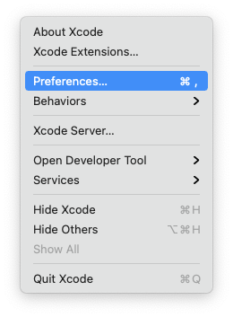
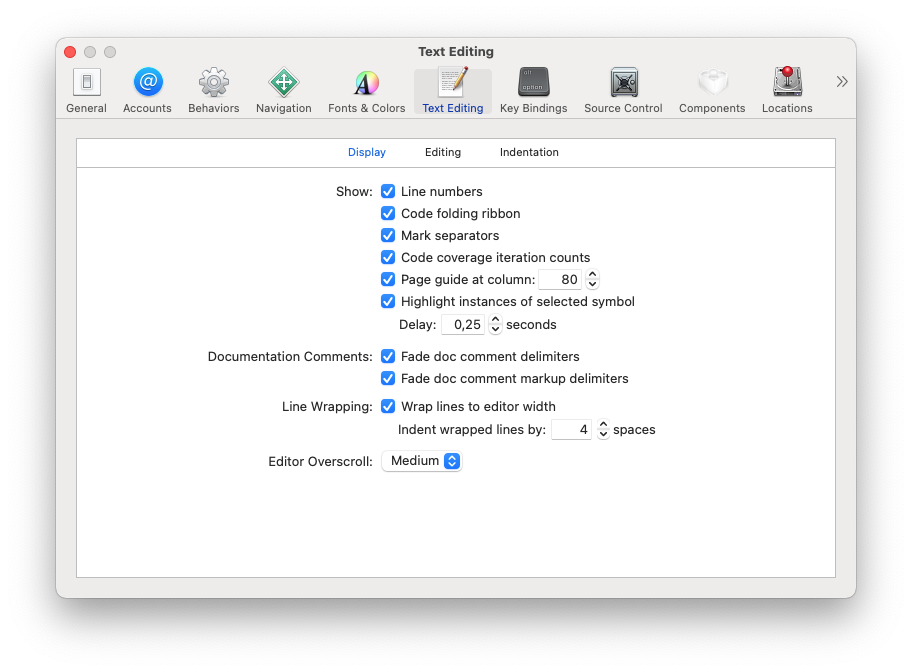
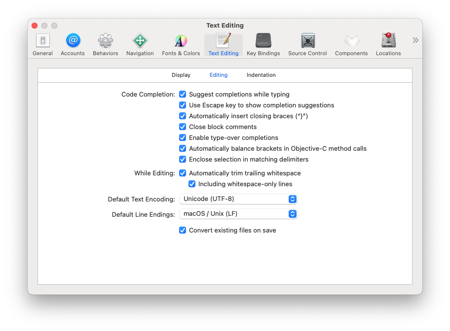
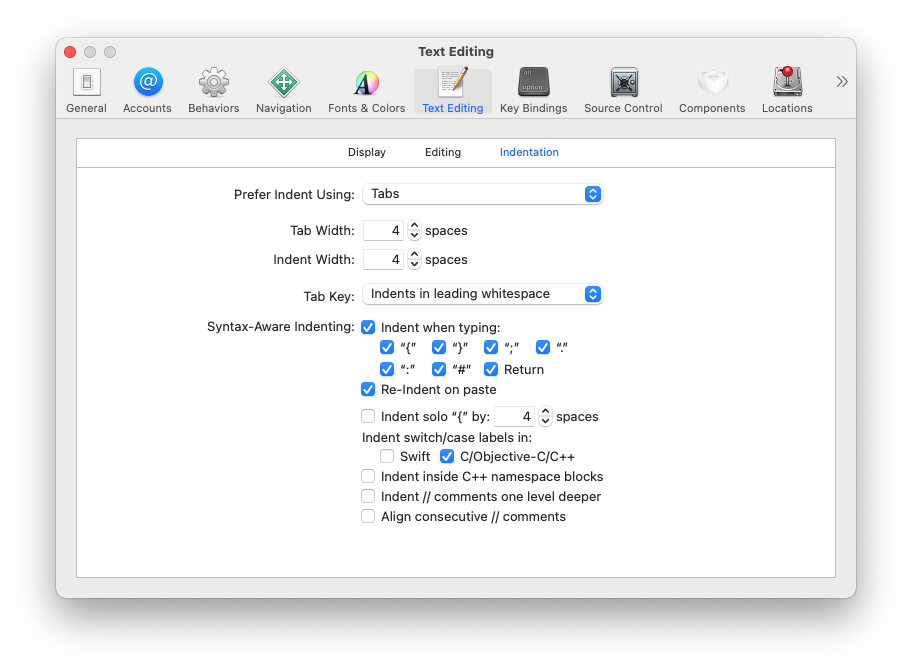
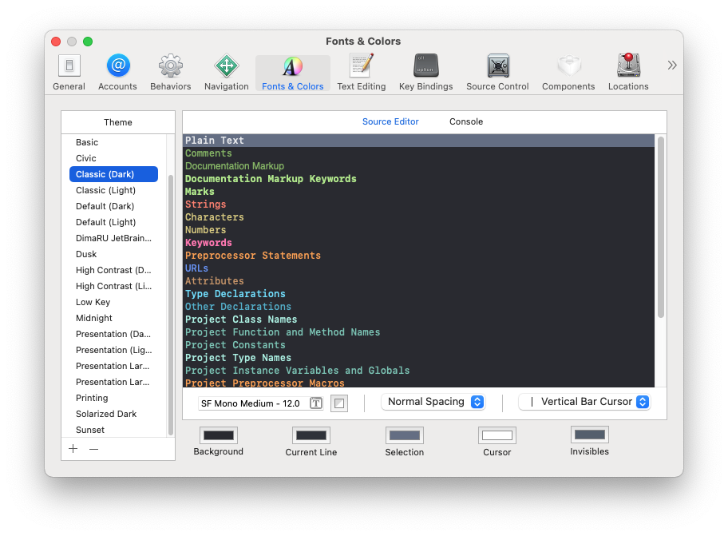
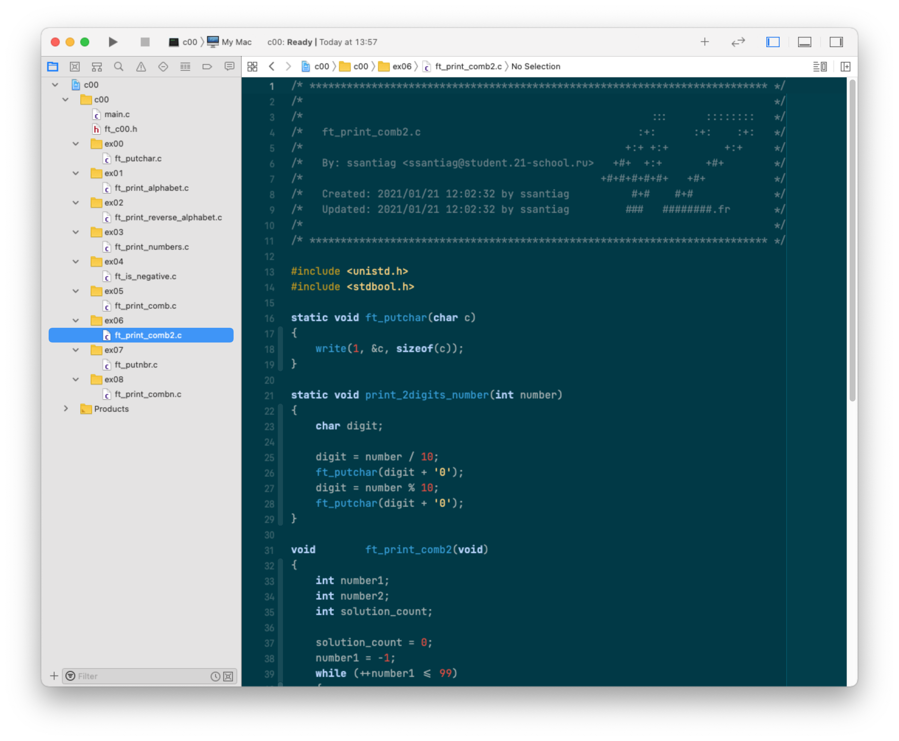

# Настройка Xcode для работы с проектами Школы 21.

1. Запустить Xcode, в меню выбрать `Xcode -> Preferences`

2. Выбрать вкладку `Text Editing`. Включить `Page guide at column: 80`

3. Выбрать `Editing`. Настроить как показано на скриншоте.

4. Выбрать `Identation`. Установить `Prefer Indent Using: Tabs`

5. Можно также выбрать другую тему для отображения текста.

6. Установить norminettelint: [https://github.com/DimaRU/NorminetteLint](https://github.com/DimaRU/NorminetteLint)
7. Установить плагин для Xcode Header 42: [https://github.com/DimaRU/School42Header](https://github.com/DimaRU/School42Header)
* Окончательный проект может выглядеть вот так:

